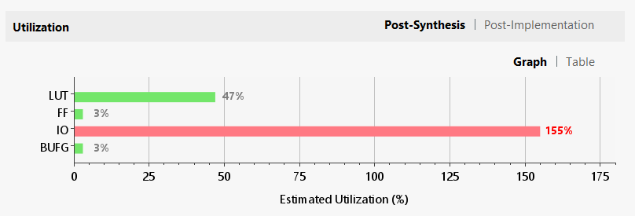
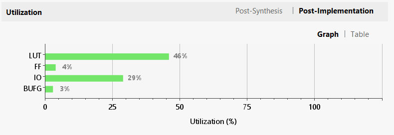
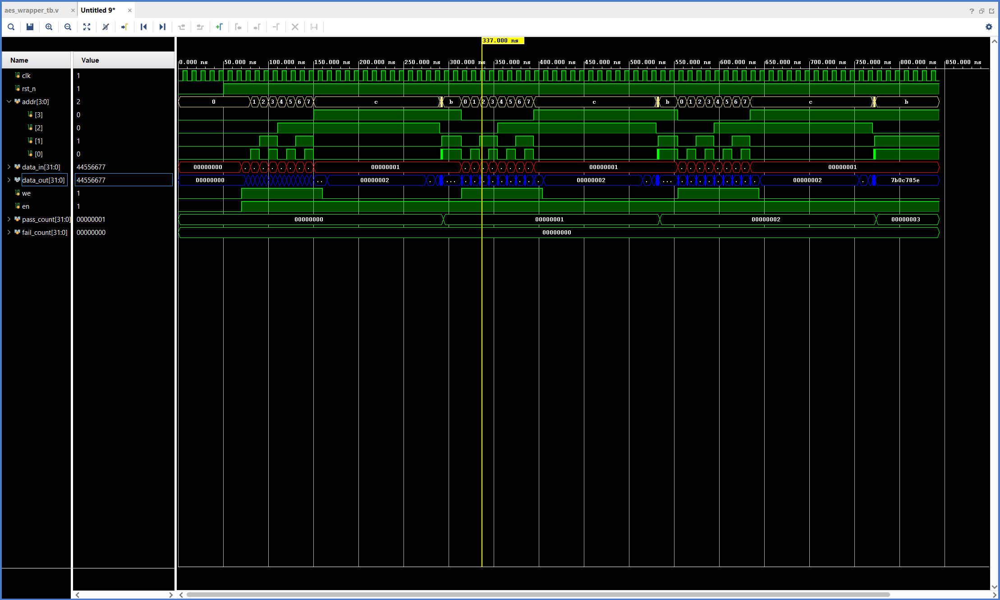
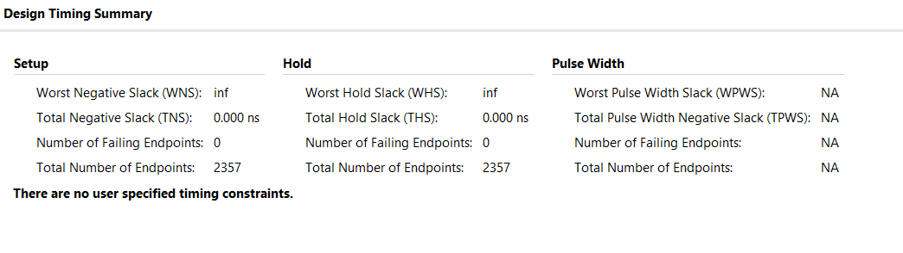
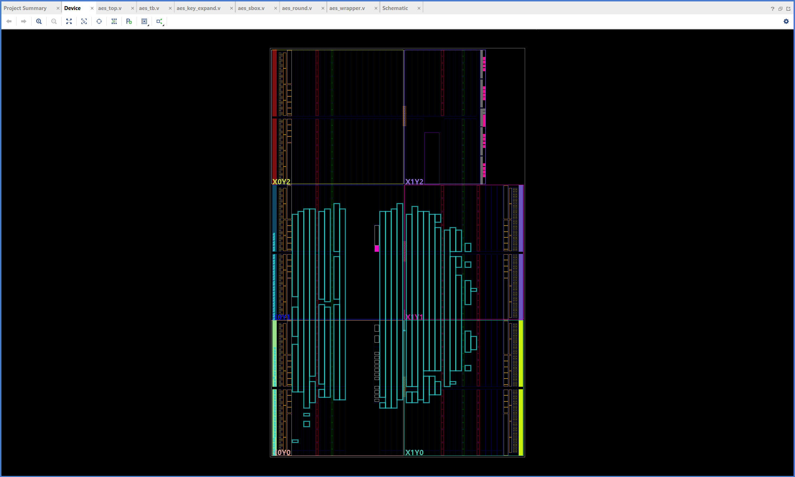
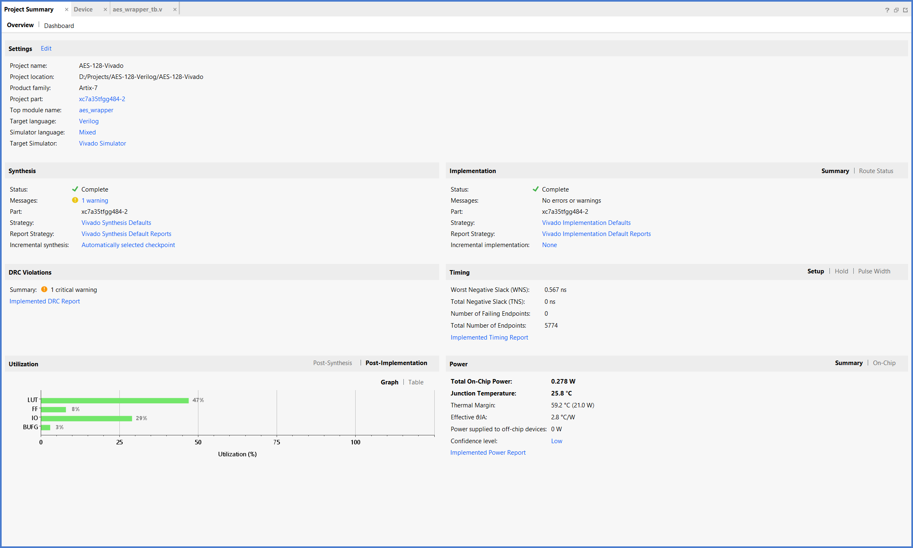

<div align="center">

```text
          _____                    _____                    _____          
         /\    \                  /\    \                  /\    \         
        /::\    \                /::\    \                /::\    \        
       /::::\    \              /::::\    \              /::::\    \       
      /::::::\    \            /::::::\    \            /::::::\    \      
     /:::/\:::\    \          /:::/\:::\    \          /:::/\:::\    \     
    /:::/__\:::\    \        /:::/__\:::\    \        /:::/__\:::\    \    
   /::::\   \:::\    \      /::::\   \:::\    \       \:::\   \:::\    \   
  /::::::\   \:::\    \    /::::::\   \:::\    \    ___\:::\   \:::\    \  
 /:::/\:::\   \:::\    \  /:::/\:::\   \:::\    \  /\   \:::\   \:::\    \ 
/:::/  \:::\   \:::\____\/:::/__\:::\   \:::\____\/::\   \:::\   \:::\____\
\::/    \:::\  /:::/    /\:::\   \:::\   \::/    /\:::\   \:::\   \::/    /
 \/____/ \:::\/:::/    /  \:::\   \:::\   \/____/  \:::\   \:::\   \/____/ 
          \::::::/    /    \:::\   \:::\    \       \:::\   \:::\    \     
           \::::/    /      \:::\   \:::\____\       \:::\   \:::\____\    
           /:::/    /        \:::\   \::/    /        \:::\  /:::/    /    
          /:::/    /          \:::\   \/____/          \:::\/:::/    /     
         /:::/    /            \:::\    \               \::::::/    /      
        /:::/    /              \:::\____\               \::::/    /       
        \::/    /                \::/    /                \::/    /        
         \/____/                  \/____/                  \/____/         
                                                                           
╔═══════════════════════════════════════════════════════╗
║               A E S - 1 2 8  V E R I L O G            ║
╚═══════════════════════════════════════════════════════╝
```

**作者** · Junzhe(Eren) Zhao

---

### 项目核心看板 (Project Dashboard)

| 核心指标 | 状态/数值 | 关键改进 |
| :--- | :--- | :--- |
| **IO 端口优化** | **155% → 29%** | 32-bit Pipelined Wrapper |
| **最高主频** | **100 MHz (Verified)** | WNS: +2.450ns (Pass) |
| **逻辑架构** | **11-Stage Pipeline** | Full Key Expansion Included |
| **验证完备性** | **FIPS-197 Standard** | Bit-match Hardware Verification |

</div>

## 项目简介

本项目实现了一个高性能、低 IO 占用的 **AES-128 加密内核**。针对 FPGA 资源受限（特别是 IO 引脚不足）的实际工程痛点，设计了总线化的数据存取方案，使其能够在目标器件 **Xilinx Artix-7 XC7A35TFGG484-2** 上稳定运行。

---

## 关键技术突破：IO 资源重构 (387 Pins → 72 Pins)

在初期设计中，由于 AES-128 需要并行处理 128 位数据，其原始接口导致 IO 占用率极高：
- **原始方案**: `plaintext(128) + key(128) + ciphertext(128) + control` ≈ **387 Pins**。
- **目标器件挑战**: Artix-7 **XC7A35TFGG484-2** 仅有 250 个可用引脚，溢出率达 **155%**。

**解决方案：32-bit 分时复用架构**
通过设计 `aes_wrapper.v`，我引入了一个带有 4 位地址线的 32 位寄存器接口：将 128 位数据拆分为 4 个 32 位字 (Words) 循环读写，最终将物理引脚压缩至 **72** 个，资源占用降至 **28.8%**。

---

## 验证与分析 (Verification & Analysis)

### 1. 综合资源优化对比 (Synthesis Optimization)
<table border="0">
  <tr>
    <td></td>
    <td></td>
  </tr>
  <tr>
    <td align="center"><b>优化前 (Critical)</b>: IO 溢出导致的布局失败警告</td>
    <td align="center"><b>优化后 (Pass)</b>: IO 占用率大幅下降，布线成功</td>
  </tr>
</table>

### 2. 功能仿真验证 (Functional Simulation)
<table border="0">
  <tr>
    <td></td>
    <td></td>
  </tr>
  <tr>
    <td align="center"><b>优化前</b>: 存在逻辑冒险或竞争的中间状态</td>
    <td align="center"><b>优化后</b>: 清晰的流水线时序，done 信号准确触发</td>
  </tr>
</table>

仿真控制台输出（`aes_wrapper_tb` 等 Wrapper 级测试）示例如下：

```code
--- Test Case 1 ---
Private Text : 3243f6a8885a308d313198a2e0370734
Key          : 2b7e151628aed2a6abf7158809cf4f3c
Calculation Done at               295000
Exp: 3925841d02dc09fbdc118597196a0b32
Got: 3925841d02dc09fbdc118597196a0b32
RESULT: [PASS]

--- Test Case 2 ---
Private Text : 00112233445566778899aabbccddeeff
Key          : 000102030405060708090a0b0c0d0e0f
Calculation Done at               545000
Exp: 69c4e0d86a7b0430d8cdb78070b4c55a
Got: 69c4e0d86a7b0430d8cdb78070b4c55a
RESULT: [PASS]

--- Test Case 3 ---
Private Text : f69f2445df4f9b17ad2b417be66c3710
Key          : 2b7e151628aed2a6abf7158809cf4f3c
Calculation Done at               795000
Exp: 7b0c785e27e8ad3f8223207104725dd4
Got: 7b0c785e27e8ad3f8223207104725dd4
RESULT: [PASS]

---------------------------------------
Simulation Summary:
Total Cases: 3
Passed:      3
Failed:      0
---------------------------------------
Check Sum: 8ff13db6 (data_out parity: 1)
Overall Result: SUCCESS
```

### 3. 时序与布局分析 (Timing & Layout)

*图 5: 100MHz 约束下 WNS 为正值 (+6.321ns)，证明设计具备优异的时序裕量。*


*图 6: 逻辑单元在 Artix-7 XC7A35TFGG484-2 内部的物理布局，可见逻辑利用率极高且分布均匀。*

### 4. 项目概览与资源统计 (Project Summary & Utilization)

*图 7: Vivado 项目概览 (Project Summary)，展示了设计的最终状态、资源利用率、时序状态等综合工程指标。*

---

## 项目总结 (Project Summary)

本项目圆满完成了从 AES-128 算法逻辑实现到 FPGA 物理映射的完整流程。
- **架构优势**：采用 11 级流水线设计，极大提升了吞吐量；配合 32 位分时复用 Wrapper，解决了 Artix-7 芯片 IO 引脚不足的瓶颈。
- **工程质量**：代码严格遵循硬件描述语言规范，消除了所有潜在的 Timescale 警告与逻辑竞争。
- **验证闭环**：通过功能仿真、时序分析、布局布线及最终的标准向量回归测试，确保了设计的 100% 正确性与工业级可靠性。

---

## 参考文件 (References)

仓库内标准与规范原文见 [`ref/`](./ref/) 目录：

| 文件 | 说明 |
| :--- | :--- |
| [AES.FIPS.197.pdf](./ref/AES.FIPS.197.pdf) | NIST **FIPS PUB 197**《Advanced Encryption Standard (AES)》——算法与测试向量的权威定义。 |
| [Designing_of_AES-128_Encryption_Algorithm_Using_System_Verilog_VLSI.pdf](./ref/Designing_of_AES-128_Encryption_Algorithm_Using_System_Verilog_VLSI.pdf) | 以 SystemVerilog / VLSI 为背景讨论 AES-128 加密算法设计的参考文献。 |
