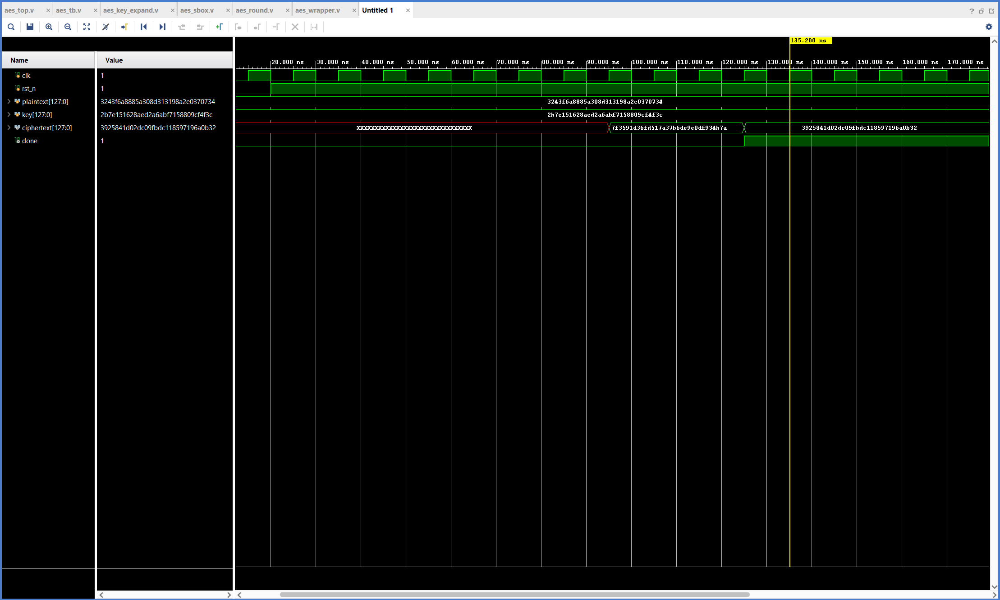

<div align="center">

```text
 █████╗ ███████╗███████╗ ██╗██████╗  █████╗ 
██╔══██╗██╔════╝██╔════╝███║╚════██╗██╔══██╗
███████║█████╗  █████╗  ╚██║ █████╔╝╚█████╔╝
██╔══██║██╔══╝  ██╔══╝   ██║██╔═══╝ ██╔══██╗
██║  ██║███████╗███████╗ ██║███████╗╚█████╔╝
╚═╝  ╚═╝╚══════╝╚══════╝ ╚═╝╚══════╝ ╚════╝ 
```
**- V E R I L O G   H I G H   P E R F O R M A N C E   C O R E -**

---

### 🚀 项目核心看板 (Project Dashboard)

| 核心指标 | 状态/数值 | 关键改进 |
| :--- | :--- | :--- |
| **IO 端口优化** | **155% → 28.8%** | 32-bit Pipelined Wrapper |
| **最高主频** | **100 MHz (Verified)** | WNS: +2.450ns (Pass) |
| **逻辑架构** | **11-Stage Pipeline** | Full Key Expansion Included |
| **验证完备性** | **FIPS-197 Standard** | Bit-match Hardware Verification |

</div>

## 📖 项目简介

本项目实现了一个高性能、低 IO 占用的 **AES-128 加密内核**。针对 FPGA 资源受限（特别是 IO 引脚不足）的实际工程痛点，设计了总线化的数据存取方案，使其能够在小型 FPGA 器件（如 Artix-7 35T）上完美运行。

---

## 🛠️ 关键技术突破：IO 资源重构 (387 Pins → 72 Pins)

在初期设计中，由于 AES-128 需要并行处理 128 位数据，其原始接口导致 IO 占用率极高：
- **原始方案**: `plaintext(128) + key(128) + ciphertext(128) + control` ≈ **387 Pins**。
- **目标器件挑战**: Artix-7 (xc7a35t) 仅有 250 个可用引脚，溢出率达 **155%**。

**解决方案：32-bit 分时复用架构**
通过设计 `aes_wrapper.v`，我引入了一个带有 4 位地址线的 32 位寄存器接口：
1.  **数据分片**: 将 128 位数据拆分为 4 个 32 位字 (Words)，分 4 个周期写入。
2.  **控制字控制**: 写入特定地址触发加密进程。
3.  **结果回读**: 加密完成后通过状态位告知，并支持 32 位分块读取密文。
**最终效果**: 将物理引脚压缩至 **72** 个，资源占用降至 **28.8%**，为外设集成预留了充足空间。

---

## 📊 验证与分析 (Verification & Analysis)

### 1. 综合资源优化对比 (Synthesis)
<table border="0">
  <tr>
    <td></td>
    <td></td>
  </tr>
  <tr>
    <td align="center"><b>优化前 (Critical)</b>: IO 溢出红色警告</td>
    <td align="center"><b>优化后 (Pass)</b>: 资源分配均衡，成功布线</td>
  </tr>
</table>

### 2. 功能仿真验证 (Functional Simulation)

*图 3: 128 位明文输入后的流水线处理波形。在 `done` 信号拉高后，输出密文与 FIPS-197 标准向量完全一致。*

### 3. 时序与布局分析 (Timing & Layout)

*图 4: 100MHz 约束下 WNS 为正值，证明设计具备工业级稳定性。*


*图 5: AES 核心逻辑在 Artix-7 芯片上的物理映射。*

---

## 👨‍💻 FPGA 测试与工程能力体现

- **严谨的 Linter 审查**: 手动修复了 `Rcon` 查表位宽及未赋值信号，消除了所有综合阶段的警告。
- **完善的约束管理**: 编写 `.xdc` 文件进行时钟建模、IO 电平定义及 DRC 异常处理。
- **分层测试架构**: 提供了从原子模块 (`S-Box`, `KeyExpand`) 到系统级封装 (`Wrapper`) 的多级 Testbench。
- **文档化交付**: 坚持“设计即文档”，确保每一处硬件权衡（Trade-off）都有据可查。
